# Normalización 1FN – 2FN – 3FN en PostgreSQL

Este repositorio es para el ejercicio práctico de normalización de una tabla de matrículas.  
Partí con una tabla “plana” y la fui llevando a 1FN, 2FN y 3FN usando PostgreSQL.

---

## 0. Creación de la base y tabla inicial

Primero creé la base de datos y la tabla `enrollments_raw` con los datos desnormalizados.  
En esta tabla los cursos, nombres de curso e instructores vienen como listas separadas por `|`.

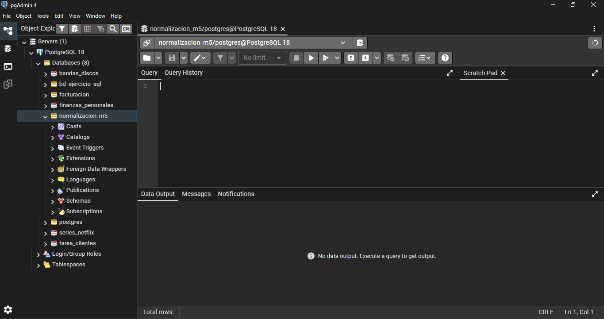

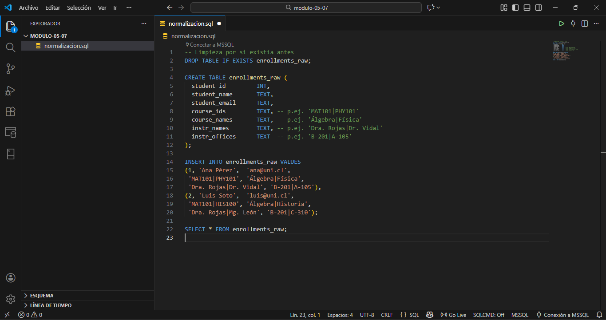

---

## 1. Paso 1 – Primera Forma Normal (1FN)

En este paso creé la tabla `enrollments_1fn`.  
Usé `split_part` junto con `generate_series` para separar las listas y obtener una fila por estudiante–curso.

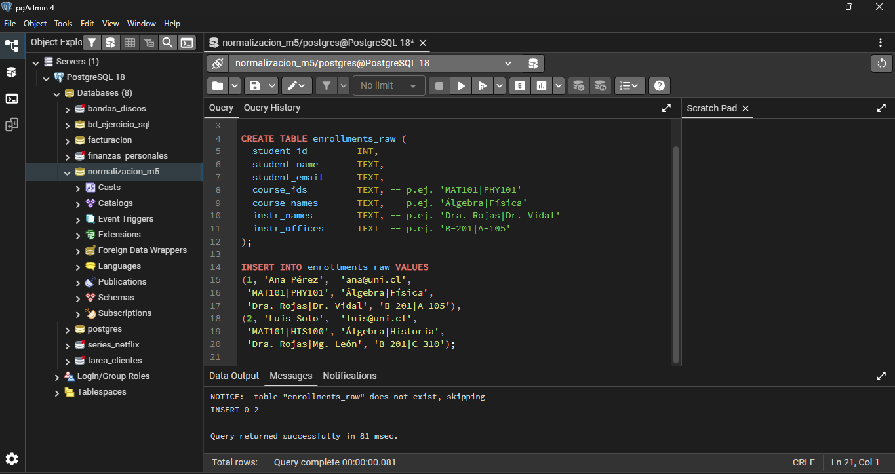

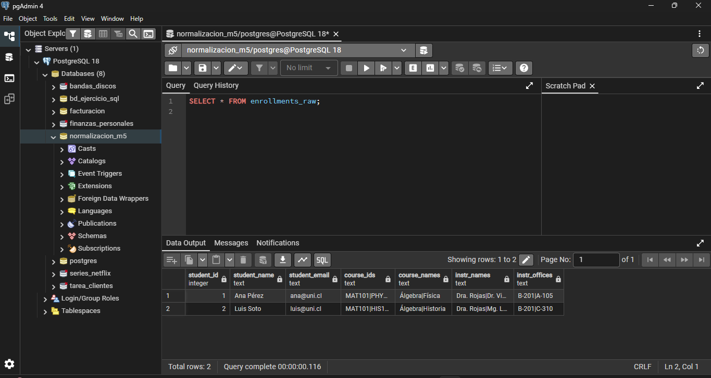

En 1FN ya no hay listas dentro de una celda; cada columna tiene un solo valor.

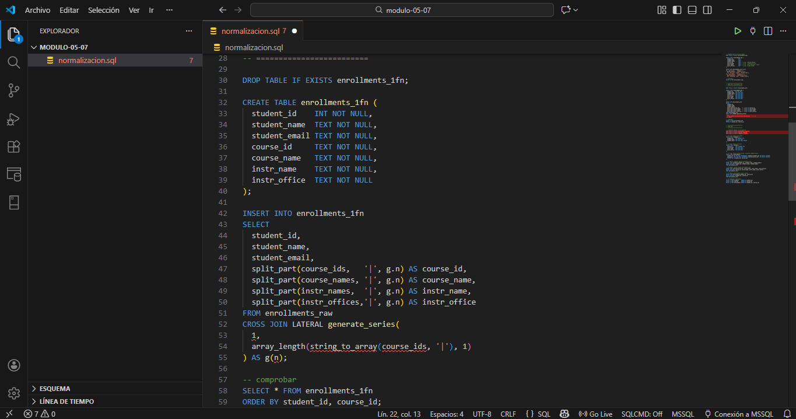

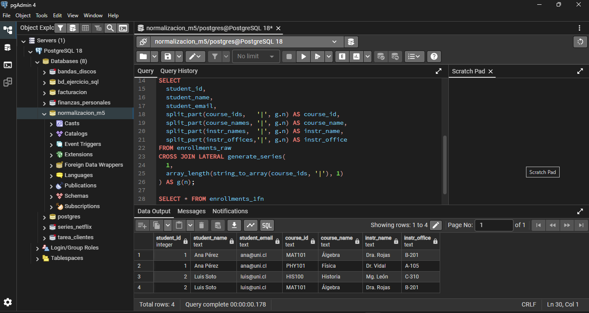

---

## 2. Paso 2 – Segunda Forma Normal (2FN)

Después separé la información en tres tablas:

- `students` (datos del estudiante)
- `courses` (datos del curso e instructor)
- `enrollments` (relación entre estudiante y curso)

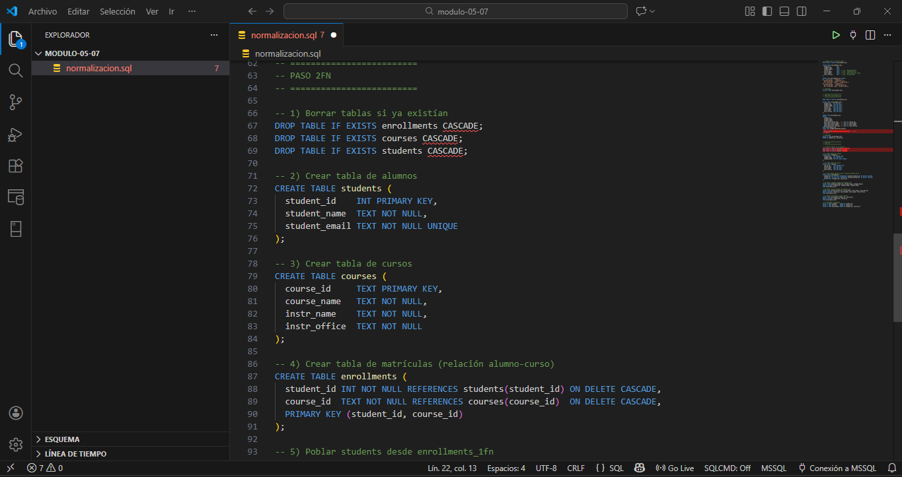

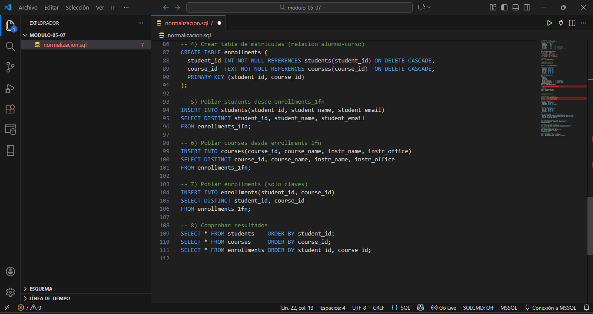

En este punto los datos del alumno dependen de `student_id` y los del curso dependen de `course_id`, y `enrollments` solo guarda las claves.

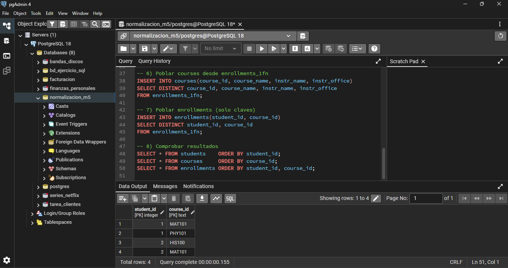

---

## 3. Paso 3 – Tercera Forma Normal (3FN)

Para llegar a 3FN saqué a los instructores a una tabla aparte:

- `instructors(instr_name, instr_office)`

Luego dejé `courses` con una FK a `instructors` usando `instr_name`.

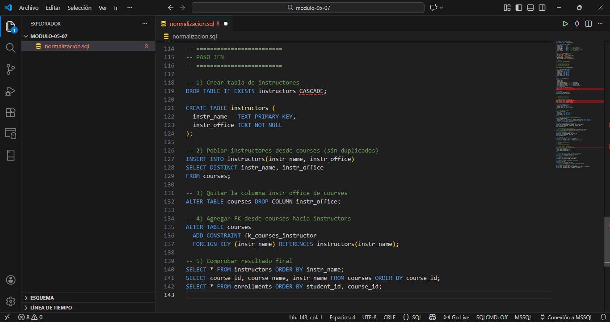

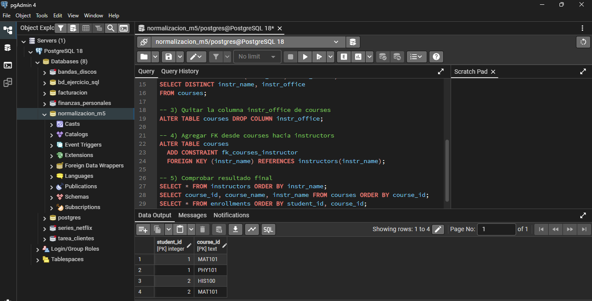

Así evito que la oficina del instructor dependa indirectamente del curso.

---
## 4. Consultas de comprobación

Al final agregué consultas para revisar que todo quedó bien en 3FN.

### 4.1 Alumnos con sus cursos e instructores

SELECT s.student_name, s.student_email, c.course_id, c.course_name,
       i.instr_name, i.instr_office
FROM enrollments e
JOIN students    s ON s.student_id = e.student_id
JOIN courses     c ON c.course_id  = e.course_id
JOIN instructors i ON i.instr_name = c.instr_name
ORDER BY s.student_name, c.course_id;

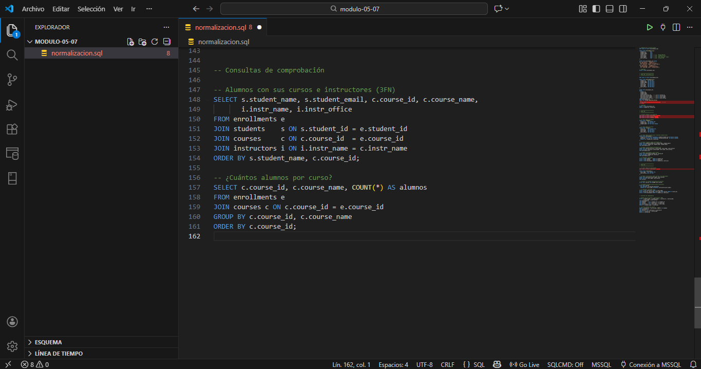

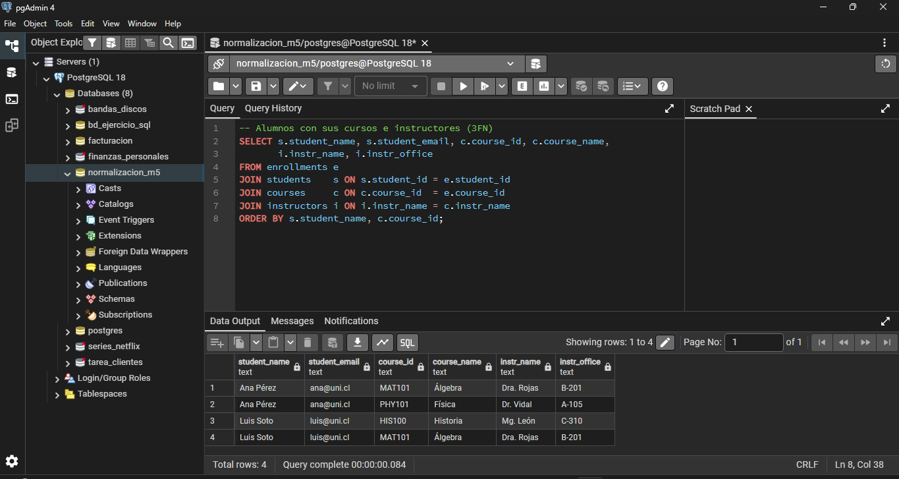

### 4.2 Cantidad de alumnos por curso

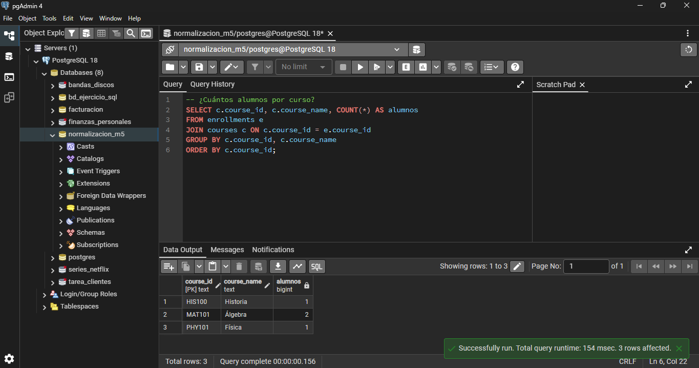

## Archivos

- `normalizacion.sql` - El script con todos los pasos (tabla inicial, 1FN, 2FN y 3FN).
- `README.md` - Este archivo de documentación explicativo.
- `img/` - Capturas de pantalla por cada paso del ejercicio.

## Autor

Patricio Valenzuela

## Repositorio GitHub

https://github.com/PATRICIORVH/modulo-05-07
